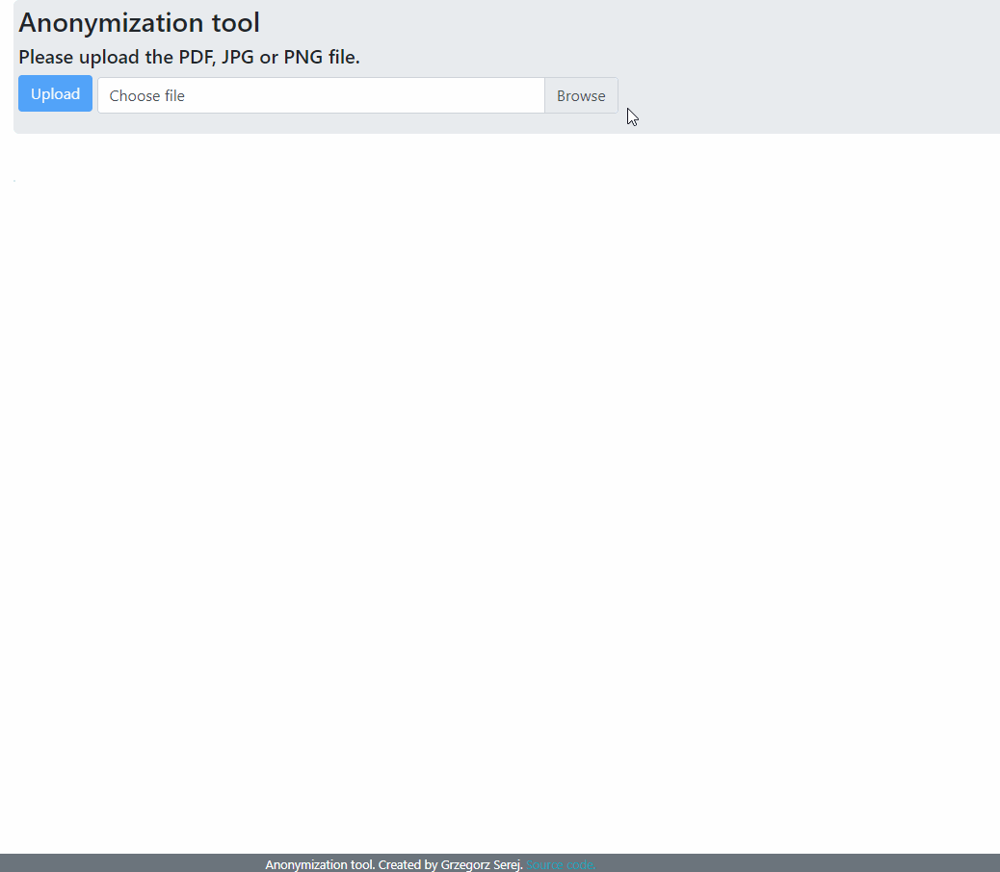

# Anonimization Tool

A Spring Boot based application created to help users to speed up the process of document redaction.

When a user upload either a PDF or an image file, content of it is displayed on the main page and meanwhile
 the back-end application extracts all the words from the document, try to categorize them based on the type 
 (dates, phone numbers, first names etc.) and expose information about words locations to the front-end page.
  Next the user can select the type of information to redact and red boxes are displayed around these words.
   User then can click on boxes to turn them into black ones to confirm selection.
    At the end when user clicks on the "Do anonymization" button, locations of marked boxes are sent back to the
     Spring application and it generates a redacted PDF file and expose a download link.
   

Used technology stack:
- Java
- Spring Boot
- Spring MVC
- Redis
- Maven
- Tess4J
- PDFBox
- JUnit 5
- JavaScript
- jQuery
- Bootstrap 4
and more...

Running the project locally
====================
Please use the master branch for testing purposes as an application on development branch may not work correctly.

You need to have Redis running locally.

To run this application run the command: `mvn clean install spring-boot:run`

Then go to the http://localhost:8080/ page.

